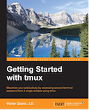

```
Roberto Nogueira  
BSd EE, MSd CE
Solution Integrator Experienced - Certified by Ericsson
```
# eBook Getting Started with tmux



**About**

Learn everything you need to about the subject of this `eBook` project.

[Homepage](https://www.packtpub.com/hardware-and-creative/getting-started-tmux)

## Topics
```
Table of Contents

1: JUMP RIGHT IN
[ ] Running tmux
[ ] Sessions
[ ] Naming the session
[ ] Explaining tmux commands
[ ] Summary
2: CONFIGURING TMUX
[ ] Using the set-option command
[ ] Creating a tmux configuration file
[ ] Emacs or vi mode
[ ] Enabling mouse modes
[ ] Changing the status bar
[ ] Binding keys
[ ] Unbinding keys
[ ] Status bar revisited
[ ] Option types
[ ] Handy configuration tips
[ ] Accessing the man page
[ ] Show options
[ ] Summary
3: SESSIONS, WINDOWS, AND PANES
[ ] Overviews
[ ] Playing around with sessions, windows, and panes
[ ] Working with more panes
[ ] Zooming panes
[ ] Resizing panes
[ ] Switching between panes by number
[ ] Cycling through pane layouts
[ ] Other pane operations
[ ] Summary
4: MANIPULATING TEXT
[ ] Explaining the Window history
[ ] Explaining the different tmux modes
[ ] Interacting with the paste buffer
[ ] Working with the paste buffer
[ ] Summary
5: DIVING DEEPER
[ ] Understanding tmux commands and Command mode
[ ] Advanced paste buffer usage
[ ] An advanced session and window usage
[ ] Breaking panes
[ ] Joining panes
[ ] Launching with defaults
[ ] Summary
6: TMUX FOR SSH, PAIR PROGRAMMING, AND MORE
[ ] Using tmux over SSH for long lived sessions
[ ] Using tmux for pair programming
[ ] Summary
7: USING OTHER TOOLS WITH TMUX
[ ] Using tmux with the OS X Pasteboard
[ ] tmux configuration from the maximum-awesome project, by Square
[ ] Using tmuxinator to make session management easier
[ ] Using wemux to ease multiuser experience
[ ] Listing other tools to be used with tmux
[ ] Summary
```
